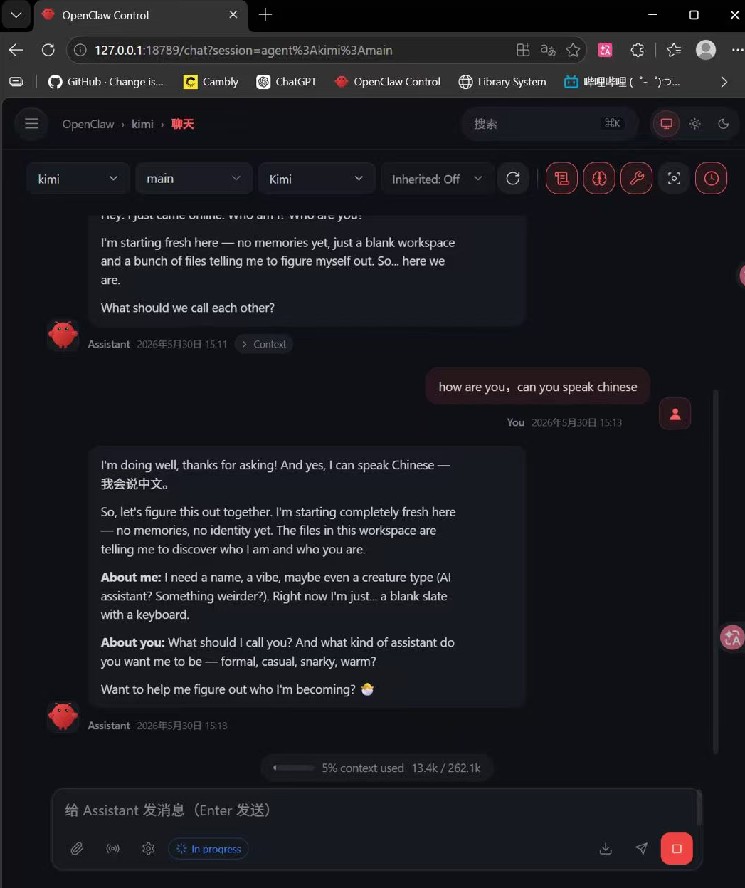
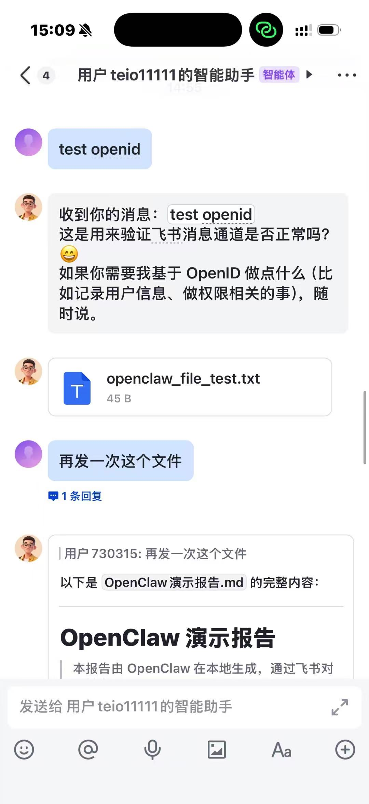

# OpenClaw 飞书文件传输 Skill 演示

本项目是一个 OpenClaw Skill 示例，用于演示如何通过 OpenClaw 调用本地 Python 脚本，并借助飞书开放平台 API，把电脑本地文件发送到飞书/Lark。

这个项目主要展示 OpenClaw 不只是聊天工具，而是可以作为 Agent 调用外部工具、执行本地任务，并把结果发送到其他应用。

---

## 项目功能

- 支持从 Windows 本地发送文件到飞书
- 支持常见文件类型，例如 `.txt`、`.docx`、`.pdf`、`.png`、`.zip`
- 使用飞书 App ID 和 App Secret 进行认证
- 使用环境变量保存敏感信息，避免把密钥写进代码
- 先上传文件到飞书，再发送给指定用户或群聊

---

## 项目结构

Skills/
└── feishu-file-transfer/
    ├── README.md
    ├── SKILL.md
    ├── send_file_to_feishu.py
    └── requirements.txt
使用前准备

需要提前准备飞书开放平台应用的以下信息：

FEISHU_APP_ID
FEISHU_APP_SECRET
FEISHU_RECEIVE_ID
FEISHU_RECEIVE_ID_TYPE

安装依赖

进入 Skill 文件夹：

cd .\Skills\feishu-file-transfer

安装依赖：

python -m pip install -r requirements.txt
测试命令

示例：发送桌面上的测试文件到飞书。

python .\send_file_to_feishu.py "C:\Users\YourName\Desktop\test.txt" --app-id $env:FEISHU_APP_ID --app-secret $env:FEISHU_APP_SECRET --receive-id $env:FEISHU_RECEIVE_ID --receive-id-type open_id
演示效果

本项目可以实现：

电脑本地文件
↓
OpenClaw Skill 调用 Python 脚本
↓
飞书开放平台 API 上传文件
↓
飞书手机端收到文件

项目总结

这个项目展示了 OpenClaw 的基础 Agent 能力：用户不只是和模型聊天，而是可以让 OpenClaw 调用本地工具，操作本地文件，并和飞书等外部应用进行交互。

通过这个 Skill，OpenClaw 可以把电脑本地文件发送到飞书，从而实现简单的跨平台文件传输自动化。

## 演示截图

### OpenClaw / 飞书机器人回复

### 飞书手机端收到文件

